<div align="center">
  <h3>
    <a href="README.md">🇻🇳 Tiếng Việt</a> | 🇺🇸 English
  </h3>
</div>

<div align="center">
  
  <h1>appCarParking</h1>
  <p><strong>Smart Parking Management Ecosystem (Mobile & Web)</strong></p>
  
  <p>
    <a href="https://flutter.dev"></a>
    <a href="https://dart.dev"></a>
    <a href="https://firebase.google.com"></a>
    <a href="https://supabase.com"></a>
    <a href="#"></a>
  </p>
</div>

---

## 📖 Overview

**appCarParking** is a comprehensive ecosystem designed to solve the problem of parking management and searching. Built with Flutter, the project provides mobile applications for Customers, Guards, and a Web-based Administration system. The modular architecture makes the system easy to scale, maintain, and deploy.

## ✨ System Features

The system is divided into 3 main modules:

### 1. Customer App
- **📍 Map & Search:** Integrated with OpenStreetMap to find nearby parking lots in real-time.
- **📅 Booking:** Allows users to reserve parking spaces in advance and manage booking history.
- **⭐ Favorites:** Save frequently used parking locations.
- **🗺️ Navigation:** Provides directions to the selected parking lot.

### 2. Guard App
- **🔍 QR Scanner:** Scan customer's booking QR codes for quick check-in/check-out.
- **📋 History Management:** View the history of vehicles entering and exiting the parking lot.
- **📊 Real-time Statistics:** Monitor the current number of vehicles in the lot.

### 3. Web Admin Dashboard
- **📈 Dashboard:** Provides an overview of revenue, number of users, and bookings.
- **🏢 Parking & Owner Management:** Add, edit, delete information about parking lots and their owners.
- **👥 User & Booking Management:** Manage customer lists and booking transactions.
- **💰 Revenue Management:** Detailed revenue statistics and reports.
- **🚗 Traffic Simulation:** Features to simulate traffic flow and parking lot operations.

## 🛠️ Technology Stack

*   **Frontend & Mobile:** Flutter (Dart)
*   **State Management:** BLoC & GetX
*   **Backend & Database:** Supabase (PostgreSQL), Firebase
*   **Mapping:** OpenStreetMap, Flutter Map

## 📂 Architecture & Folder Structure

The project adopts a Feature-Driven architecture, clearly separating modules for each user role:

```text
lib/
 ├── core/              # Core configs: Theme, constants, environment variables (env)
 ├── features/          # Main features of the application
 │   ├── auth/          # User authentication (Login, Register)
 │   ├── customer/      # Customer module (Account, Booking, Home, Map)
 │   ├── guard/         # Guard module (History, Home, Scanner)
 │   └── web_admin/     # Web Admin dashboard (Dashboard, Parking, Revenue, Simulation...)
 ├── model/             # Data models definition (Booking, ParkingLot, User...)
 ├── routes/            # Navigation routing management
 ├── services/          # Backend communication layer (SupabaseService)
 └── main.dart          # Application entry point
```

## 📸 Screenshots

<div align="center">
  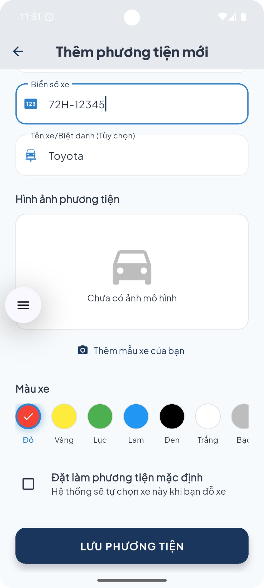
  
  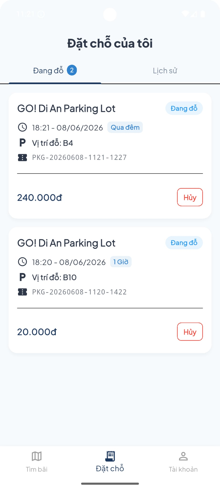
  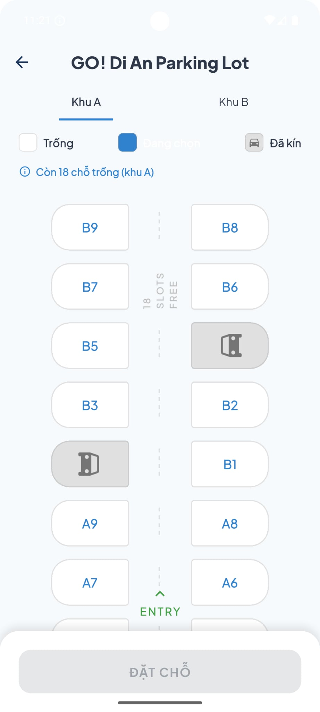
  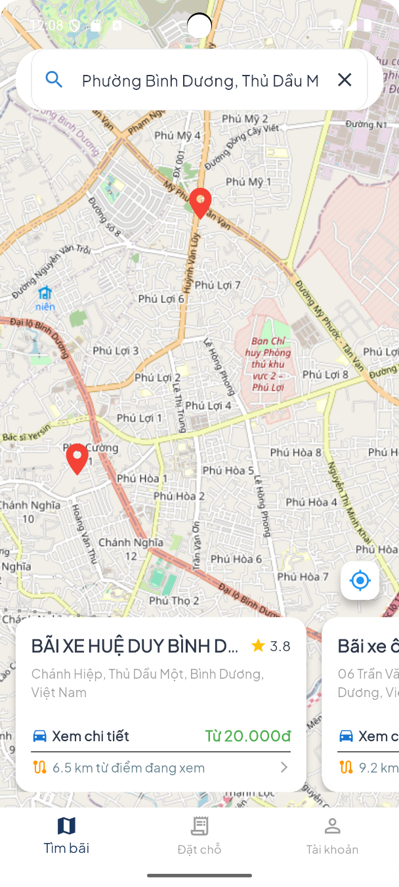
  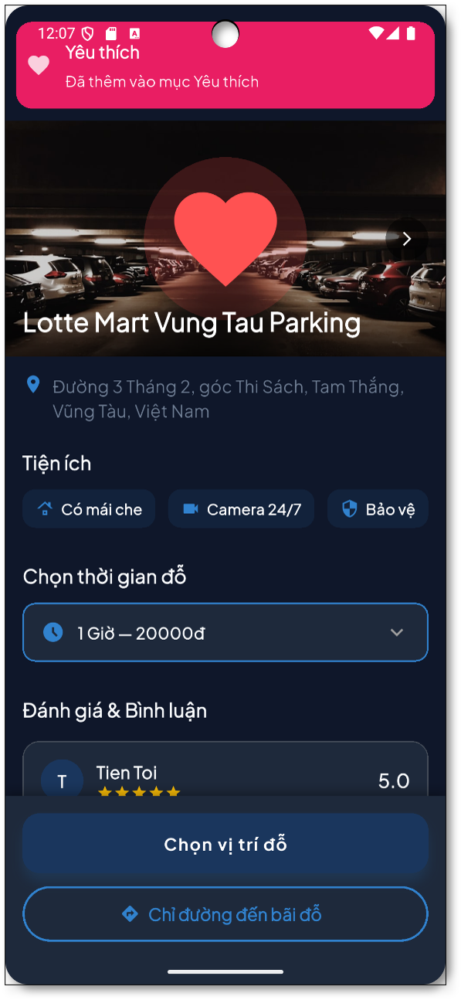
  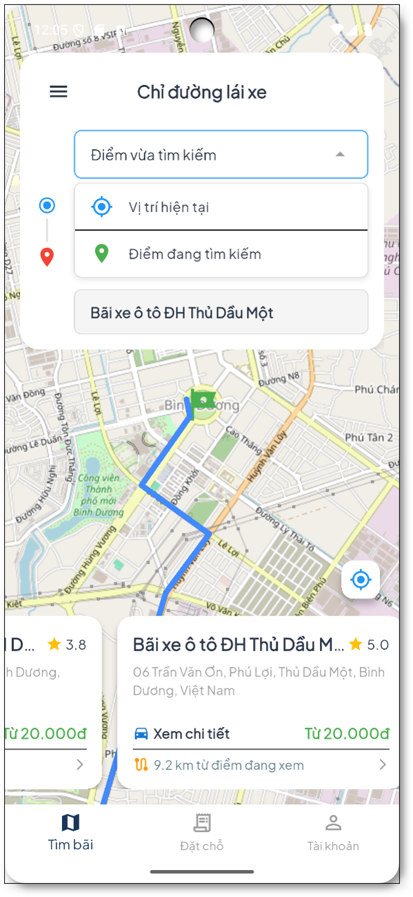
  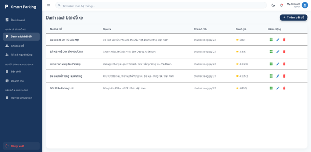
  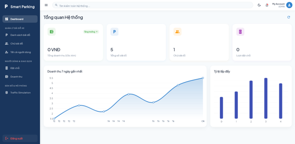
  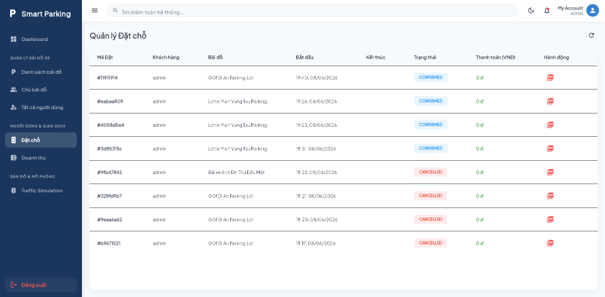
  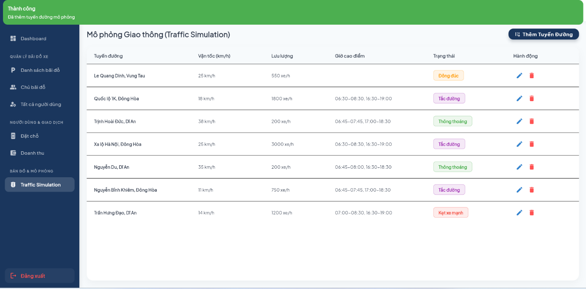
  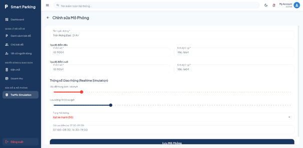
  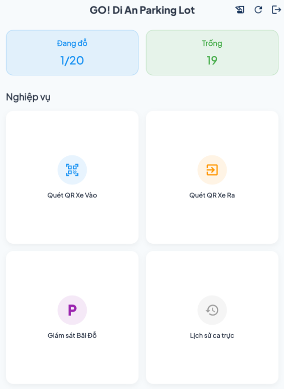
</div>

## 🎥 Demo Video

<div align="center">
  <a href="https://youtu.be/a_uk1ptQd1U">
    
  </a>
</div>

## 🚀 Getting Started

Follow these instructions to set up the environment and run the project locally.

### Prerequisites

*   [Flutter SDK](https://docs.flutter.dev/get-started/install) (latest stable version)
*   Android Studio / Xcode / VS Code
*   Supabase & Firebase CLI configuration

### Installation Steps

1.  **Clone the repository**
    ```bash
    git clone https://github.com/yourusername/appCarParking.git
    cd appCarParking
    ```

2.  **Install dependencies**
    ```bash
    flutter pub get
    ```

3.  **Environment Setup**
    *   Create a `.env` file in the root directory and configure Supabase keys.
    *   (If using Firebase) Configure `google-services.json` (Android) and `GoogleService-Info.plist` (iOS).

4.  **Run the application**
    *   For Mobile (Android/iOS):
        ```bash
        flutter run
        ```
    *   For Web Admin:
        ```bash
        flutter run -d chrome
        ```

## 🔮 Future Improvements

- [ ] Implement AI-driven parking availability prediction.
- [ ] Integrate automated online payment gateways (Stripe/PayPal/VNPay).
- [ ] Implement Smart License Plate Recognition (ALPR/ANPR) via Camera.
- [ ] Integrate IoT hardware systems (Parking sensors, Automated Barrier Gates, etc.).
- [ ] Expand localization for additional countries.

## 🤝 Contributing

Contributions, issues, and feature requests are welcome. Feel free to check the [issues page](https://github.com/XkingzX/appCarParking/issues) if you want to contribute.

## 👤 Author: **Ngo Tien Toi**

- 💼 LinkedIn: [Ngô Tiến Tới](https://www.linkedin.com/in/ngotientoi/)
- 🐙 GitHub: [@Xk1ngzX](https://github.com/XkingzX)
- ✉️ Email: ngotientoi21@gmail.com

---
<div align="center">
  <sub>Developed with all my heart, I hope viewers will enjoy it ❤️.</sub>
</div>
